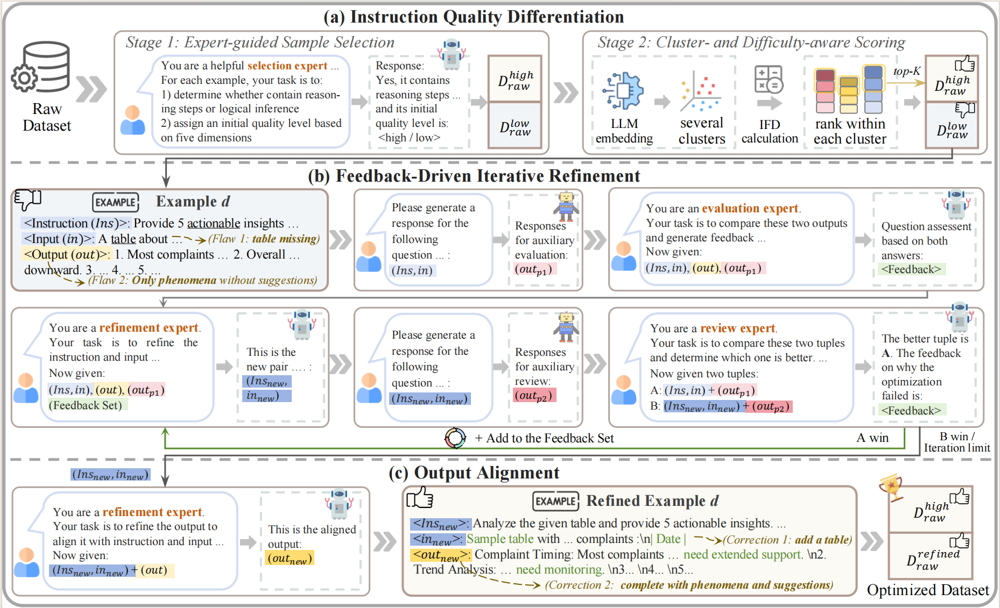
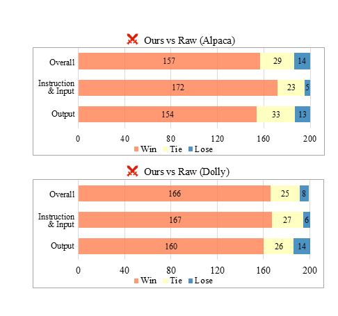

<p align="center">
<h1 align="center">From Selection to Refinement: Iterative Optimization for Instruction Data</h1>

<p align="center">
    <a href=""></a>
    <a href="https://github.com/surihuhang/AIDO/blob/main/LICENSE"></a>
    <a href=""></a>
</p>

---

## 📑 Contents
- [Overview](#overview)
- [Key Highlights](#key-highlights)
- [Human Evaluation](#human-evaluation)
- [Install](#install)
- [Usage](#Usage)
- [Contact](#Contact)
---

## Overview

We propose a novel automated iterative framework for instruction data optimization that systematically enhances instruction tuning datasets through **two key stages**:  **data selection** and **data refinement**.

1. **Stage 1 — Data Selection:**  
   AIDO separates high- and low-quality samples using a **coarse-grained LLM scoring and classifing** module and a **fine-grained metric ranking and clustering** module, ensuring precise filtering of suboptimal data.

2. **Stage 2 — Data Refinement:**  
   Low-quality samples are **iteratively revised** via evaluation and semantic consistency checks — correcting factual errors, completing omissions, removing redundancies, and improving alignment between instructions and responses.



## Key Highlights

- **Performance Gains:**  
  - Achieves **61.02%** accuracy on *Alpaca*, surpassing prior SoTA selection and revision methods by **+2.50%** and **+2.09%**.  
  - Achieves **60.39%** accuracy on *Dolly*, outperforming prior SoTA selection and revision methods by **+3.65%** and **+2.60%**.
- **Sample Efficiency:**  
  - Uses **32.69% / 50.00% fewer samples** (vs. raw & best baseline) on *Alpaca*.  
  - Uses **20.00% / 79.66% fewer samples** (vs. raw & best baseline) on *Dolly*.  

| Dataset    | Accuracy (%) | Δ vs Raw data | Δ vs SoTA (Selection) | Δ vs SoTA (Revision) | Data Reduction (vs Raw / SoAT)(%) |
| :--------- | :----------: |:-------------:| :-------------------: | :------------------: | :-------------------------------: |
| **Alpaca** |     61.02    |     +6.69     |         +2.50         |         +2.09        |            32.69 / 50.00          |
| **Dolly**  |     60.39    |     +4.72     |         +3.65         |         +2.60        |            20.00 / 79.66          |

AIDO not only enhances **data quality** but also significantly improves **reasoning, factuality**, and **generalization** across diverse task types.

---

## Human Evaluation

We conducted a rigorous human evaluation with **three trained annotators**, employing **majority voting** to determine outcomes.  
All sample sources and versions were **anonymized** to prevent bias.  
Demonstrates AIDO’s **comprehensive correction** across all components evaluation — instructions, inputs, and outputs.

- **Lose probabilities:** 7.00% (*Alpaca*), 4.00% (*Dolly*)  
- **Instruction/Input failure rates:** reduced to 2.50% and 3.00%, respectively  
- **Output failure rates:** reduced to 6.50% and 7.00%, respectively  

<p align="center">
  
</p>

---

## Install
Before running AIDO, please make sure you have **Python ≥ 3.9** and **conda** (or **pip**) installed.

You can create a clean environment for AIDO (recommended via conda):

```bash
conda create -n aido python=3.10
conda activate aido
```

AIDO mainly depends on the following:

```bash
openai<=0.28.0 
transformers==4.55.3 
torch==2.8.0 
tokenizers==0.21.4 
tqdm==4.67.1 
vllm==0.10.0
```

- Ensure your CUDA version matches the installed torch version.

- If you encounter compatibility issues with GPUs, you can check PyTorch installation guide
 for the correct CUDA wheel.

- vllm requires CUDA and supports efficient inference of large models such as Llama.

---


## Usage 

### 1. Data Selection Module

#### (1) Environment Setup

Deploy the **Llama-70B** model with [vLLM](https://github.com/vllm-project/vllm):

```bash
conda activate evalscope

CUDA_VISIBLE_DEVICES=0,1 nohup python -m vllm.entrypoints.openai.api_server \
    --model MODEL_PATH \
    --served-model-name llama3.1-70B \
    --dtype bfloat16 \
    --port YOUR_API_PORT \
    --tensor-parallel-size 2 \
    --gpu-memory-utilization 0.95 \
    --max-model-len 8192 > vllm-70B.log 2>&1 &
```
* **`YOUR_API_PORT`**: Port for your OpenAI-compatible API server (e.g., 9000)
* **`./models/Llama-3.3-70B-Instruct`**: Path to your local model

#### (2) Step 1 — Coarse-Grained LLM Scoring & Classification

```bash
python Select/Classifing_Scoring.py \
    --input_path ../Dataset/Dolly_data_15k.json \
    --output_dir ../Result/Dolly \
    --api_base "[http://0.0.0.0:9000/v1](http://0.0.0.0:9000/v1)" \
    --model_name "llama3.1-70B" \
    --name Dolly
```
* **`--input_path`**: Path to the raw dataset (e.g., Dolly, Alpaca). (Replace with your dataset)

* **`--output_dir`**: Directory to save scoring results.

* **`--api_base`**: API endpoint for the deployed Llama model.

* **`--model_name`**: The model name defined in the vLLM server.

* **`--name`**: Dataset name tag for output files.


#### (3) Step 2 — Fine-Grained Metric Ranking & Clustering

```bash
CUDA_VISIBLE_DEVICES=2,3 nohup python Select/Clustering_Ranking.py \
    --json_data_path ../Result/Dolly/ \
    --model_name_or_path ../models/Meta-Llama-3.1-8B-Instruct \
    --output_dir ../Result/Dolly/ \
    --max_length 4096 \
    --name Dolly > Dolly_stage_2.log 2>&1 &
```
* **`--json_data_path`**: Directory containing scoring results from Step 1.

* **`--model_name_or_path`**: Path to smaller evaluation model (8B).

* **`--output_dir`**: Output directory for clustered/ranked data.

* **`--max_length`**: Maximum token length for model input.

* **`--name`**: Dataset name for log identification.


### 2. Data Revision Module

#### (1) Environment Setup
Deploy both Llama-70B and Llama-8B using vLLM:
```bash
# Strong model (70B)
conda activate evalscope
CUDA_VISIBLE_DEVICES=0,1 nohup python -m vllm.entrypoints.openai.api_server \
    --model ./models/Llama-3.1-70B-Instruct \
    --served-model-name llama3.1-70B \
    --dtype bfloat16 \
    --port 9000 \
    --tensor-parallel-size 2 \
    --gpu-memory-utilization 0.95 \
    --max-model-len 8192 > vllm-70B.log 2>&1 &

# Backbone model (8B)
CUDA_VISIBLE_DEVICES=2 nohup python -m vllm.entrypoints.openai.api_server \
    --model ./models/Llama-3.1-8B-Instruct \
    --served-model-name llama3.1-8B \
    --dtype bfloat16 \
    --port 8000 \
    --tensor-parallel-size 1 \
    --gpu-memory-utilization 0.85 \
    --max-model-len 8192 > vllm-8B.log 2>&1 &
```

#### (2) Run Iterative Revision
Edit Revise/step_run.sh to configure the model endpoints:
```bash
export Strong_API_BASE="http://0.0.0.0:9000/v1"     # 70B model
export Strong_MODEL_NAME="llama3.1-70B"
export Backbone_API_BASE="http://0.0.0.0:8000/v1"   # 8B model
export Backbone_MODEL_NAME="llama3.1-8B"

Dataset_dir="../Result/Dolly/"
Base_dir="../Result/Dolly/Revise_step_output"
result_Path="${Dataset_dir}Dolly_Revised.json"
name="Dolly"
```
Then execute:
```bash
bash Revise/Iterative_Revise_Run.sh
```

* **`Strong_API_BASE`**: API of the stronger model (used for evaluation/revision).

* **`Strong_MODEL_NAME`**: Model name of the strong model (e.g., Llama-70B).

* **`Backbone_API_BASE`**: API of the smaller model (used as backbone).

* **`Backbone_MODEL_NAME`**: Model name of the backbone model (e.g., Llama-8B).

* **`Dataset_dir`**: Directory containing selected dataset results.

* **`Base_dir`**: Output directory for iterative revisions.

* **`result_Path`**: Path to save the final revised dataset.

* **`name`**: Dataset identifier (e.g., Dolly, Alpaca).


#### (3) Merge High-Quality and Revised Data

```bash
python Result/Connect.py \
    --input_path_1 "./Result/Dolly/Dolly_high.json" \
    --input_path_2 "./Result/Dolly/Dolly_Revised.json" \
    --output_path "./Result/Dolly/Dolly_Final_Data.json"
```

---

## Contact
- Please feel free to contact us if you need any help: *******
- __Attention__: Only real name emails will be replied. Please provide as much detail as possible about the problem you are experiencing.

---

